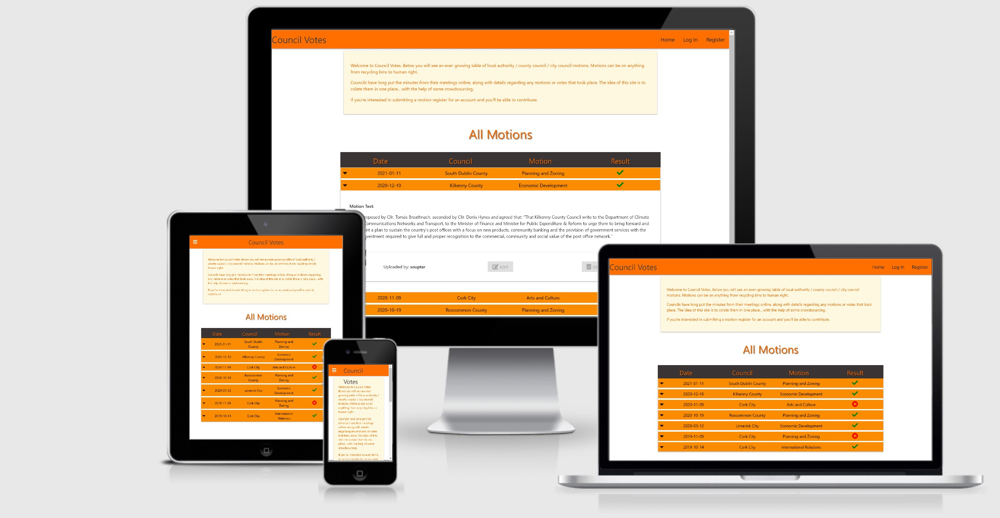
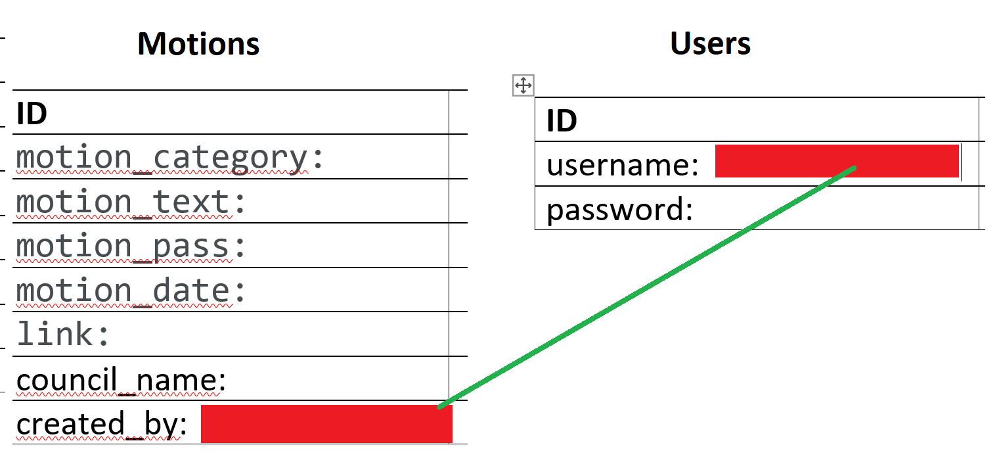

# Council Votes

A site where members of the public can view what motions have been passed in any of the over 30 local authorities around the country. See the text of any motion thtas been uploaded as well as seeing them catogorized into different topics and by city or county council.

## How It Works

Any user can go to the site and see what motions have been uploaded. If a user wishes to register an account, that gives them the ability to submit their own motions. Any user can edit or delete the motions they have submitted.


## Demo

You visit Council Votes right away by clicking
[here](https://jj-council-votes.herokuapp.com/#)
</img>

## Database design
</img>

## User Experience (UX)
To make the web simple for the user to understand and to give necessairy information about how to use the website

- ### User stories
    -   #### New user Goals
        1. As a new user, I want to know how the website works.
        2. As a new user, I want register an account.
        3. As a new user, I want to look through motions from different councils and see what has passed and what hasn't.

    -   #### Returning user Goals.
        1. As a returning user, I want to see new motions and the database to grow.

    -   #### Frequent user Goals
        1. As a frequent user, I want to log in my account. 
        2. As a frequent user, I want to view the site on multiple device. 
        3. As a frequent user, I want to be able to submit motions myself.

-   ### Design
    -   #### Colour Scheme
        *   Main color used are shade of orange, brown, black and white


## Features

* Allow user to view on multiple device
* Allow user register, log in and log out his/her account
* Allow user to understand how to use and what the Council Votes site provides.
* Allow user to create, edit, read and delete from a shared database.

<a name="browsersuport"></a>
## Browser support

-   ### The browser version that fully supports.
    * Chromium *(1.20.103)*
    * Firefox *(16.0)*
    * Chrome *(36.0)*
    * Opera *(23.0)*
    * Safari *(9.0)*

## Testing
-   [W3C Markup Validator](https://validator.w3.org/) - [Results](mockups/validator.jpg)
- Although there were many errors they all seemed to be in relation to Jinja commands or illegal characters that I had to use.

### Testing User Stories from User Experience (UX) Section
-   #### New user Goals
  
    1. As a new user, I want register an account
        * User can register an account, data will be stored in mongoDB's Database (users)

    3. As a new user, I want to look for information on what county and city councils are voting on
        * There is a CRUD capable database there for use.

        
-   #### Frequent user Goals
    1. As a frequent user, I want to log in my account. 
        * user can log in his or her account if he/she has already registered.

    2. As a frequent user, I want to view Council Votes on multiple device. (responsive) 
        * Each device have its own style which make the web responsive. So user can view on a mobile phone or a computer.

    3. As a frequent user, I want to be able to submit motions myself
        * There is a page for submitting motions for users where they can copy and paste the vote details from local council meeting minutes. 
### Further Testing
* All links were tested. Internal links all work. External links all work and open in new window.
* The data displayed correctly, all buttons link to a correct destination.
* I tested the site out on several differnt browsers throughout.
* Users are able to Edit, Add, Remove motions to the website after signing up and logging in.
* Users can't Edit or Remove motions which others added.
* I tried multiple times to sign up for an account using the same usernames, non-matching passwords etc. so that I could see it was validating properly.
* Similarly with uploading the motions, editing them, and deleting them. I ensured they had gone from the db as well.

## Technologies

**Languages:**
* [HTML5:](https://www.w3schools.com/html/default.asp)
    - HTML5 was used to code the content of the website.
* [CSS:](https://www.w3schools.com/css/default.asp)
    - CSS3 was used to style the content.
* [JavaScript:](https://www.w3schools.com/js/default.asp)
    - JavaScript was used to style the significant interactive functionality.
* [Python:](https://www.w3schools.com/python/default.asp)
    - Python was used for the project back-end functions. Flask and Python is used to build route functions.

**Tools and Libraries:**
* [W3C Validator:](https://validator.w3.org/)
    - The W3C Markup Validator and W3C CSS Validator Services were used to validate every page of the project to clear syntax errors.
* [Font-Awesome:](https://fontawesome.com/)
    - Font Awesome was used on all pages throughout the website to add icons for aesthetic and UX purposes.
* [Flask:](https://flask.palletsprojects.com/)
    - web application framework used to create functions with Python that are injected into html templates. 
* [jQuery:](https://jquery.com/)
    - jQuery library was used to simplify the JavaScript.
    
* [MongoDB:](http://mongodb.com/)
* [Python:](https://www.python.org/)
* [Materialise](materializecss.com)
* [Git:](https://git-scm.com/)
    - Git was used for version control by utilizing the Gitpod terminal to commit to Git and Push to GitHub.
* [Cdnjs](cdnjs.com)
* [Favicon.io](http://favicon.io)


## Deployment
This site is hosted using GitHub pages, deployed directly from the master branch. The deployed site will update automatically upon new commits to the master branch. In order for the site to deploy correctly on GitHub pages, the landing page must be named index.html.

To run locally, you  can clone this repository directly into the editor of your choice by pasting the link into your terminal. To cut ties with this GitHub repository, type git remote rm origin into the terminal.

### `How to open this project`
1. Copy this link "https://jj-council-votes.herokuapp.com/"
1. Paste and open on a browser


### `How to make a Local Clone`

1. Log in to GitHub and locate the [GitHub Repository](https://github.com/)
1. Under the repository name, click "Clone or download".
1. To clone the repository using HTTPS, under "Clone with HTTPS", copy the link.
1. Open Git Bash
1. Change the current working directory to the location where you want the cloned directory to be made.
1. Type `git clone`, and then paste the URL you copied in Step 3.
1. Type this then Press Enter. Your local clone will be created.
```
$ git clone https://github.com/YOUR-USERNAME/YOUR-REPOSITORY
```

```
$ git clone https://github.com/YOUR-USERNAME/YOUR-REPOSITORY
> Cloning into `CI-Clone`...
> remote: Counting objects: 10, done.
> remote: Compressing objects: 100% (8/8), done.
> remove: Total 10 (delta 1), reused 10 (delta 1)
> Unpacking objects: 100% (10/10), done.
```

Click [Here](https://help.github.com/en/github/creating-cloning-and-archiving-repositories/cloning-a-repository#cloning-a-repository-to-github-desktop) to retrieve pictures for some of the buttons and more detailed explanations of the above process.

## Heroku

By using Heroku platform for Council Votes, the following steps were taken:

### Create A Heroku App

* Navigated to [Heroku.com](https://www.heroku.com/) in web browser. Once there, clicked on "Sign Up" and created a new account.
* Chose 'Python' as Primary Development Language.
* Selected "**Create new app**" from the Heroku dashboard.
* Filled in the unique app name on the form and selected corresponding region, then clicked on "**Create app**"

### Install Heroku CLI

I used the Heroku command-line interface, within the Terminal:

* `npm install -g heroku` - to install Heroku  
* Type: `heroku login -i` then login to created account

### Connect Git remote

we can either link our local Git repository with Heroku, or setup Automatic
Deployment from GitHub.

To link the local Git repository to Heroku:

* `git status` - to check the current state of the repository.
* `git init` - to initialize empty repository (If repository not created already)
* `git add -A` - to add all the files to staging area.
* `git commit -m "Deployment to Heroku"` - to commit changes.
* `git push -u heroku main` - to push code directly to Heroku.

### Adding A requirements.txt File

To add the list of Python dependencies that the project needs in order to run successfully and detect the language:

* `pip3 freeze --local > requirements.txt` - command in the terminal to create a requirements.txt file, 
* `git add -A` - to add what will be commited
* `git commit -m "Add requirements.txt"` - to commit changes.
* `git push -u heroku main` - to push file to Heroku.

### Adding A Procfile

To inform Heroku on how to run the application and which file runs it the **Procfile** was installed:

* `echo web: python app.py > Procfile` - with a capital 'P' command in the terminal to redirect the echo command.
* `git add Procfile` 
* `git commit -m "Add Procfile` 
* `git push`

## Credits
- ### Content

* Inspiration and base code was derived from the Mini Project section of the [Code Institute](https://courses.codeinstitute.net/)

## Content
* Almost every city and county council puts their meeting information and minutes online, e.g [Cork City](https://www.corkcity.ie/en/council-services/councillors-and-democracy/meetings-of-the-city-council/full-council-meetings/full-council-meetings-minutes/)

<a name="Ack"></a>
-   ### Acknowledgements
    * Inspiration and base code was derived from the Mini Project section of the [Code Institute](https://courses.codeinstitute.net/).

    * Special thanks to my tutor Roman for supporting me during the project